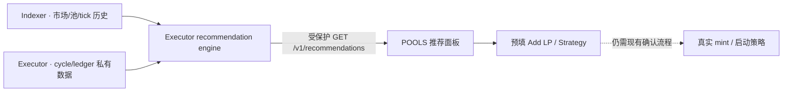

# LP 自动推荐系统实施方案

> 文档状态：可实施设计稿
> 核对日期：2026-08-15（Asia/Shanghai）
> 适用范围：Robinhood Mainnet（chainId `4663`）上的 UP33 CL 与官方 Uniswap V3
> 核心目标：推荐“现在更适合开哪一个 LP、采用多长的观察窗口、设置多宽的区间”，并估算手续费/奖励能否覆盖 Gas、换仓成本和币价下跌风险。

## 1. 结论

这个功能可以做，而且现有代码已经具备大部分执行与核算基础，但不能简单地把池子页的 `FEE APR` 排序改名为“推荐”。正确的第一版应是一个**可解释的、资金规模相关的决策系统**：

1. 同时比较 `1H / 6H / 24H` 成交热度，自动选择最可信的计算窗口，而不是选择数值最高的窗口。
2. 对每个候选区间回放 tick 路径，估算每天越界/重开次数。
3. 用用户计划投入金额计算自己的流动性份额和手续费，不使用池平均 APR 代替用户收益。
4. 从生产 ledger/cycle 校准 Gas、换仓滑点和协议扣费，再计算净收益。
5. 单独展示币价/LP 库存风险。高手续费不等于高净 PnL，也不能承诺覆盖单边暴跌。
6. 推荐只负责解释和预填开仓参数，不自动修改或启动现有策略。

第一版不建议使用机器学习。当前真实数据覆盖时间较短、策略选择存在明显偏差，确定性公式加走步回测更容易审计，也更适合资金系统。积累 30 天以上数据后，再考虑用统计模型替换部分预测项。

## 2. 对需求的产品化定义

用户进入 `POOLS` 页面后输入或确认：

- 计划投入金额，默认可用 `1,000 USD` 作为标准比较本金；实际开仓时必须按真实金额重算。
- 收益模式：`手续费（不质押）` 或 `UP 排放（质押）`。
- 风险偏好：稳健 / 平衡 / 激进；本质上控制最大预计重开次数和尾部损失权重。
- 可选过滤：协议、报价币、最低 TVL、只看已有仓位。

系统返回最多 3 个候选，每个候选必须展示：

- LP、协议、费率、TVL、数据来源和更新时间。
- `采用 1H / 6H / 24H / 3D / 7D` 中的哪一个窗口，以及为什么。
- 推荐区间百分比、对齐后的 `tickLower/tickUpper` 和实际价格边界。
- 预计在区间时间、预计重开次数/天。
- 预计毛手续费或排放、Gas、换仓成本、净收益（按日和按本金比例）。
- 压力情景下的币价/LP 损失、收益覆盖率和置信度。
- 1H/6H/24H 对比与“不推荐”的主要原因。
- `带入开仓` 按钮：预填加 LP 区间；mint 成功后沿用现有流程创建策略。

推荐结果必须带 `modelVersion`、`marketAsOf` 和 `confidence`。数据过期或关键字段缺失时宁可不推荐，不能把 `null` 当成 0。

## 3. 当前系统和真实数据结论

### 3.1 已有能力

现有项目已经提供以下可复用能力：

| 能力 | 当前实现 |
|---|---|
| 池子 1H/6H/24H 成交量 | `src/lib/volumeWindows.ts`、`src/lib/poolstats.ts`、`indexer/stats.ts` |
| 池费与窗口 APR | `src/lib/apr.ts` 的 `feesOf`、`feeAprOf` |
| 用户 CL 份额/收益模拟 | `src/lib/apr.ts` 的 `simulateClAdd` |
| 百分比到 tick 区间 | `shared/strategy/range.ts` |
| 策略执行与重开 | `executor/monitor.ts`、`executor/runner.ts` |
| 每轮 Gas、swap、fee、reward 账本 | `executor/store.ts`、`executor/accounting.ts` |
| 净值与成本分解 | `executor/performance.ts` |
| tick 样本 | `price_samples`，当前每策略最多保留 24 小时 |

UP33 CL 的质押语义必须特别处理：**质押仓位不赚 LP 手续费，赚的是 UP 排放；未质押仓位才赚扣除 levy 后的手续费。** 因此“手续费推荐”和“排放推荐”必须是两种模式，不能把 staking reward 混入手续费预测。

### 3.2 生产样本快照

2026-08-15 16:25（Asia/Shanghai）只读核对生产库和实时池数据时：

- 9 条策略正在 `monitoring`，另有 9 条已归档策略。
- 已完成 465 个重开 cycle、7,067 条 ledger、119,570 条 tick 样本。
- 活跃策略区间覆盖 ±2%、±3%、±5%、±8%。
- 单条策略最长可用运行样本约 76 小时；活跃 tick 原始样本只保留最近 24 小时。

真实结果已经证明“手续费 APR 最高”不是充分条件：

| 策略 | 区间 | 运行约 | 重开 | 毛收入 | Gas + 换仓 | 当前 PnL |
|---|---:|---:|---:|---:|---:|---:|
| WETH/STONKBROKER · UNIV3 | ±3% | 75.8h | 88 | 0.2307 WETH | 0.0207 WETH | +23.55% |
| WETH/FRONG · UP33（质押） | ±2% | 75.7h | 108 | 0.1210 WETH | 0.0374 WETH | -42.15% |
| WETH/CASHCAT · UP33（质押） | ±2% | 74.0h | 37 | 0.0556 WETH | 0.0218 WETH | -18.70% |
| WETH/YARD · UP33 | ±2% | 68.5h | 2 | 0.0030 WETH | 0.00013 WETH | -14.08% |
| WETH/MSTR · UNIV3 | ±3% | 41.2h | 1 | 0.0051 WETH | 0.00008 WETH | +2.05% |

这里的“毛收入”沿用当前 performance 口径，质押策略包含已兑换的 UP 奖励，不能当作 LP fee。不同 quote token 的行也不能直接横向相加。

同一时点池子窗口也呈现出完全不同的趋势：

| 池 | 1H 池平均手续费 APR | 6H | 24H | 判断 |
|---|---:|---:|---:|---|
| WETH/CASHCAT | 683% | 636% | 598% | 三个窗口接近，热度相对稳定 |
| WETH/FRONG | 3,537% | 1,163% | 1,480% | 1H 突增，不能直接外推 |
| WETH/STONKBROKER | 215% | 770% | 1,126% | 当前成交显著降速，24H 高估“现在” |
| USDG/RDDT | 1,084% | 1,621% | 5,597% | 24H 严重滞后，且最近 5M 为 0 |
| WETH/YARD | 34% | 47% | 115% | 热度持续下降 |

最近 24 小时 tick 回放也显示区间宽度对换仓次数影响巨大：STONKBROKER 的 ±1%/±2%/±3% 分别约触发 162/40/25 次；FRONG 约 89/44/26 次；AAPL 最近 24 小时总振幅约 1.57%，±2% 没有触发重开。这个差异必须进入推荐模型。

### 3.3 当前数据缺口

当前数据还不能直接训练一个可靠的“最优推荐模型”：

1. `pool_stats` 只保存最新滚动窗口，没有历史快照，无法检验过去哪个观察窗口预测最准。
2. `price_samples` 按 strategy 存储、只覆盖已开策略，并在 24 小时后删除；未开仓候选池没有可回测的 tick 路径。
3. 真实 outcome 只有数天，且池、区间和投入金额不是随机分配，存在选择偏差。
4. 池平均 APR 没有考虑用户新增流动性后的自我稀释、是否一直在区间、质押语义和实际换仓成本。
5. GeckoTerminal 覆盖不完整；当前部分 Uniswap 池只有 24H，没有 1H/6H。缺失值必须降低置信度。

因此正确顺序是：先补齐市场历史，再上线可解释 MVP；不能直接用 465 个 cycle 训练黑箱模型。

## 4. 推荐算法

### 4.1 候选池硬过滤

MVP 只推荐执行器已经支持且可验证身份的官方 CL 池：UP33 CL 和官方 Uniswap V3。下列情况直接排除：

- pool/position manager/factory 身份验证失败。
- token metadata、报价路径或转账行为不兼容。
- TVL、成交量或数据新鲜度低于配置阈值。建议初始默认 `TVL >= $10,000`、`V24 >= $10,000`、市场数据不超过 10 分钟；阈值放服务端配置，不写死在 UI。
- 计划投入金额超过池 TVL 的 2%，或预计单次重配价格冲击超过 1%；两项都应按真实报价复核。
- 关键窗口缺失且没有可靠降级来源。
- 手续费模式下选择了 UP33 质押仓位；排放模式下 gauge 无有效 reward stream。

黑名单只用于已知不兼容/税费 token；不能以黑名单代替链上身份、quote 和 transfer 行为校验。

### 4.2 选择观察窗口

对每个池计算各窗口的单位时间成交速率：

```text
r1  = V1h  / 1
r6  = V6h  / 6
r24 = V24h / 24
```

不能取 `max(r1, r6, r24)`，否则会系统性追逐短时尖峰。正式规则采用走步验证：

1. 在历史时点 `t`，分别用 1H/6H/24H/3D/7D 预测下一小时成交量。
2. 与 `t+1h` 的真实滚动 1H 成交量比较。
3. 每个窗口计算最近 7 天的中位绝对百分比误差，并加入数据完整度、突变和陈旧惩罚。
4. 选择误差最低且置信度达标的最短窗口；输出预测误差和选择原因。

`lp-rec-v2` 还会用 6H/24H/3D/7D 单位小时成交量的稳健下四分位限制最终预测；即使 1H 在历史上误差最低，当前 1H 构成尖峰时也必须排除，不能绕过尖峰保护。

```text
windowLoss(H)
= median(|forecast_H(t) - actual_1h(t+1h)| / max(actual, epsilon))
  + missingPenalty
  + spikePenalty

chosenWindow = argmin(windowLoss(H))
```

在历史尚未积累满 7 天的 bootstrap 阶段：

- 1H/6H/24H 都存在时默认使用 6H。
- 只有在至少 3 个连续快照中 1H 速率稳定、且没有 5M→1H 的尖峰反转时，才允许采用 1H。
- 6H 缺失时降级到 24H，并标记低置信度；不能将缺失窗口显示为 0 APR。
- 若 `r1 < 0.5 × r24`，标记成交降速；若 `r1 > 2 × r24`，标记短时突增，二者都降低预测置信度。

### 4.3 生成候选区间

基础候选使用 `{±1%, ±2%, ±3%, ±5%, ±8%, ±10%}`，再根据 tick spacing 对齐。最终比较的是对齐后的实际价格边界，不是输入百分比。

对每个区间 `b`，用与生产 monitor 相同的 spot、轮询间隔、越界判定和 recenter 逻辑回放 tick：

```text
reopens(b, H)       = 历史路径越界并重新居中的次数
inRangeRatio(b, H)  = 位于有效区间且不在执行中的时间比例
```

回放必须处理 token0/token1 与 quote/risk 方向，复用 `quoteRangeToTicks` 和 `rangeSide`，不能用简单绝对 tick 差作为生产实现。

### 4.4 预测用户手续费/排放

推荐必须以用户投入金额 `A` 计算。复用当前 CL liquidity math，将 `A` 按当前价格和区间转换为 `L_user`：

```text
feeShare = L_user / (L_active + L_user)

grossFee(b, H)
= predictedVolume(H)
  × poolFeeRate
  × (1 - unstakedLevy)
  × feeShare
  × inRangeRatio(b, H)
```

UP33 质押模式改为：

```text
LP fee = 0
reward = projected UP stream × L_user / (L_staked + L_user)
```

排放只能按 `periodFinish` 以内的承诺时段预测，超出部分不外推。手续费和排放在 UI 中必须分列。

### 4.5 预测换仓成本和下跌风险

每个候选区间的成本为：

```text
cycleCost
= medianGas(protocol, quoteType)
  + liveQuotedSwapImpact(pool, capital, boundarySide)
  + 可识别的协议/收益扣费

totalCost(b, H) = reopens(b, H) × cycleCost
expectedNet     = grossFeeOrReward - totalCost
```

历史中同池、相近投入金额和相同协议的数据优先；样本不足时依次降级为同协议/同规模桶中位数、全网保守中位数。必须显示成本来源和样本数。

正式开单门槛按风险档限制预计每日重开次数：稳健 2 次、平衡 6 次、激进 12 次。窄区间超限时，同一池应继续比较更宽区间，而不是把整个池直接淘汰。没有 USDG 锚定边的双风险资产池暂时只能进入观察候选，因为当前公共历史不足以可靠还原两个资产各自的美元风险。

币价和 LP 库存风险不应藏在一个 APR 里。用历史 tick 路径做多起点回放，计算：

- 策略净 PnL 分布。
- 相对持币（HODL）的差异。
- 95% 尾部损失（CVaR95）。
- `coverageRatio = expectedNet / abs(CVaR95 downside)`。

每个历史起点同时回放真实路径和方向反射路径，并比较 LP 自身美元回撤及相对 50/50 HODL 的落后幅度；方向反射只作为压力场景，避免一段单边上涨因为尚未发生回撤而被误判为低风险。

主排序使用风险调整后的净收益，而不是 APR：

```text
riskAdjustedNet = median(expectedNet) - riskWeight × abs(CVaR95)
```

`riskWeight` 由稳健/平衡/激进控制。页面仍展示所有原始分项，0–100 分只作为候选间排序辅助，不替代金额与风险信息。

### 4.6 置信度

置信度独立于预期收益：

- 高：窗口完整、市场历史 ≥ 7 天、成本样本 ≥ 20 cycle、数据新鲜、走步误差低。
- 中：市场历史 ≥ 24H，成本可用同协议规模桶降级。
- 低：仅有当前滚动窗口、只有 24H、或成本主要来自全网默认值。

低置信度结果可以进入“观察候选”，不进入“推荐开仓”前三名。

## 5. 数据与架构

### 5.1 采集层

在 indexer 增加两类历史，不改动 executor 的签名和交易链：

```sql
CREATE TABLE pool_market_snapshots (
  pool TEXT NOT NULL,
  ts INTEGER NOT NULL,
  source TEXT NOT NULL,
  vol_5m_usd REAL,
  vol_1h_usd REAL,
  vol_6h_usd REAL,
  vol_24h_usd REAL,
  tvl_usd REAL,
  tick INTEGER,
  liquidity TEXT,
  fee_ppm INTEGER NOT NULL,
  PRIMARY KEY (pool, ts)
);

CREATE TABLE pool_tick_samples (
  pool TEXT NOT NULL,
  ts INTEGER NOT NULL,
  tick INTEGER NOT NULL,
  block_number TEXT NOT NULL,
  PRIMARY KEY (pool, ts)
);
```

采集策略：

- 市场窗口：每 5 分钟保存一次，覆盖池子页 top 200、全部在跑策略池和用户关注池。
- tick：候选 top 50 每 60 秒一次；在跑策略继续使用 executor 约 10 秒样本做精细校准。
- 原始数据保留 30 天；之后按小时聚合保留 180 天。
- 快照写入沿用 SQLite WAL；批量事务写，增加 retention job 和 schema version。
- UP33 CL 也要纳入服务端候选目录，不能只依赖浏览器当前加载到的数组。身份仍从官方 factory/链上验证，DexScreener 只做统计增强。

当前 `price_samples` 仍服务 monitor，不应为推荐系统延长到全市场；推荐历史放 indexer，避免按 strategy 重复记录同一 pool。

### 5.2 计算边界

推荐需要市场公共数据和 executor 私有成本数据，建议保持边界：



- indexer 提供市场历史查询，不读取 executor DB。
- executor 内新增推荐引擎，读取本地 ledger 的匿名聚合，不把 tokenId、owner、tx hash 或单轮明细暴露到公共 `/api`。
- `/v1/recommendations` 继续使用现有 admin/wallet session 鉴权。
- 计算每 5 分钟缓存一次；HTTP 请求只读缓存，不能在页面请求中运行大规模回测。
- 推荐模块不得调用 signer，也不得创建 job。

### 5.3 推荐结果持久化

```sql
CREATE TABLE recommendation_runs (
  id TEXT PRIMARY KEY,
  created_at INTEGER NOT NULL,
  model_version TEXT NOT NULL,
  capital_usd REAL NOT NULL,
  mode TEXT NOT NULL,
  input_asof INTEGER NOT NULL,
  status TEXT NOT NULL
);

CREATE TABLE recommendation_items (
  run_id TEXT NOT NULL,
  rank INTEGER NOT NULL,
  pool TEXT NOT NULL,
  lookback TEXT NOT NULL,
  tick_lower INTEGER NOT NULL,
  tick_upper INTEGER NOT NULL,
  expected_fee_usd REAL,
  expected_reward_usd REAL,
  expected_cost_usd REAL NOT NULL,
  expected_net_usd REAL NOT NULL,
  cvar95_usd REAL NOT NULL,
  reopens_per_day REAL NOT NULL,
  confidence REAL NOT NULL,
  explanation_json TEXT NOT NULL,
  PRIMARY KEY (run_id, rank)
);
```

持久化 run 是为了审计“当时为什么推荐”，不是为了自动执行旧推荐。超过 10 分钟的结果在开仓前必须重算。

## 6. API 与前端

### 6.1 API

新增只读接口：

```http
GET /v1/recommendations?capitalUsd=1000&mode=fees&risk=balanced&limit=3
```

核心响应示例：

```json
{
  "modelVersion": "lp-rec-v2",
  "marketAsOf": 1786782000,
  "capitalUsd": 1000,
  "items": [{
    "pool": "0x...",
    "protocol": "univ3",
    "pair": "WETH/STONKBROKER",
    "lookback": "6h",
    "lookbackReason": "1h volume rate is below its 6h/24h baseline",
    "range": {
      "lowerPct": 5,
      "upperPct": 5,
      "tickLower": 108000,
      "tickUpper": 109000
    },
    "projection24h": {
      "grossFeeUsd": 0,
      "rewardUsd": 0,
      "gasUsd": 0,
      "swapCostUsd": 0,
      "netUsd": 0,
      "reopens": 0,
      "inRangePct": 0,
      "cvar95Usd": 0,
      "coverageRatio": 0
    },
    "confidence": { "level": "medium", "score": 0.68 },
    "warnings": []
  }]
}
```

示例中的金额是 schema 占位，不是当前池的承诺收益。真实接口必须返回计算值和输入时间。

不新增“一键自动开仓”服务端接口。`带入开仓` 只把 pool/range/capital 写入前端现有 add-liquidity flow，mint 与策略启动继续走原安全确认。

### 6.2 页面

在 `POOLS` 表格上方增加 `STRATEGY RECOMMENDER`：

1. 顶栏：投入金额、收益模式、风险偏好、刷新。
2. 推荐卡：`#1 LP`、`采用 6H`、`推荐 ±5%`、预计净收益、重开/天、置信度。
3. 展开详情：1H/6H/24H 速率对比、区间候选对比、费用/成本/下跌风险拆分、数据来源。
4. 操作：`在池子中定位`、`带入开仓`、`仅观察`。

池表可增加两列/标记：

- `REC`：推荐排名和置信度。
- `WINDOW`：本池当前采用的观察窗口。

移动端只显示排名、窗口、区间、预计净收益；详细解释放抽屉。中英文文案同时加入 `src/i18n/en.ts` 和 `zh.ts`。

## 7. 代码改动建议

| 文件/模块 | 改动 |
|---|---|
| `indexer/store.ts` | schema version、market/tick snapshot、retention 与查询 |
| `indexer/stats.ts` | 每次外部统计周期保存滚动窗口快照 |
| `indexer/state.ts` / 新 watcher | top 候选池 60 秒 tick 采样 |
| `indexer/api.ts` | 内部历史查询和 coverage/health 指标 |
| `shared/recommendation/types.ts` | 输入、候选、解释、结果类型 |
| `shared/recommendation/window.ts` | 窗口选择和 bootstrap 规则 |
| `shared/recommendation/replay.ts` | tick 对齐、越界、recenter 回放 |
| `shared/recommendation/scoring.ts` | fee/reward、成本、CVaR 和排序 |
| `executor/recommendation.ts` | ledger 成本校准、定时计算、缓存 |
| `executor/api.ts` | 受保护的只读推荐接口 |
| `src/lib/executorClient.ts` | 推荐 API client |
| `src/components/tabs/PoolsTab.tsx` | 推荐面板、标记和预填入口 |
| `src/i18n/en.ts`、`zh.ts` | 文案 |

推荐数学放 `shared/`，保证服务端计算、离线回测和单元测试使用同一份逻辑。不要把核心评分只写在 React 组件中。

## 8. 实施顺序与验收

### 阶段 A：数据基础（不上推荐 UI）

- 增加显式 DB migration/schema version。
- 保存 market/tick 历史，加入 retention 与数据覆盖率 health。
- 将当前生产 cycle/ledger 只读汇总成 `protocol + pool + band + capital bucket` 成本样本。
- 连续运行至少 7 天，确认缺口、磁盘增长和外部 API 限频。

验收：任意候选池能查询连续 1H/6H/24H tick 与市场快照；重启不丢数据、不重复写；不影响 executor RPC、签名和 nonce。

### 阶段 B：影子推荐

- 实现窗口选择、区间回放、用户份额、成本和风险计算。
- 每 5 分钟生成结果但不展示，只记录 run。
- 用走步方式比较推荐时点之后的真实 1H/6H/24H 结果。

验收：没有未来数据泄漏；同输入和 modelVersion 结果确定；缺失窗口不变成 0；区间严格对齐 tick spacing；UP33 质押手续费恒为 0。

### 阶段 C：页面 MVP

- 先向管理员/当前钱包开放推荐面板。
- 只展示中/高置信度前三名，低置信度放观察列表。
- `带入开仓` 只预填，不触发交易。

验收：每条推荐可以完整解释窗口、区间、成本和风险；结果过期会阻止继续并刷新；关闭功能开关后页面恢复现状，运行策略完全不受影响。

### 阶段 D：闭环校准

- 对“被推荐后实际启动”的策略记录 recommendation run id。
- 比较预计与实际手续费、重开次数、成本和净 PnL。
- 30 天后按池/协议/规模桶更新窗口误差与成本先验；只有在样本外表现优于规则模型时才引入统计学习。

建议上线门槛：

- 下一小时成交量预测的中位误差有稳定基线，并优于固定 24H 外推。
- 重开次数预测中位误差不超过 25%。
- Gas + 换仓成本预测中位误差不超过 20%，P90 不低估超过 30%。
- 所有金额计算对投入规模、自我稀释和 quote decimals 有测试覆盖。
- 任何推荐失败都只影响推荐面板，不影响池子页、monitor、runner 或 recovery。

## 9. 必测场景

1. 1H 缺失、6H 缺失、只有 24H：返回低置信度而非 0 收益。
2. 1H 暴增、5M 已归零：不能追逐尖峰。
3. 24H 很高但 1H/6H 持续下降：选短窗口并标记降速。
4. ±1% 手续费更高但重开成本超过收入：推荐更宽区间。
5. token0/1 与 risk/quote 方向相反：tick 边界和下破/上破仍正确。
6. tick spacing 导致百分比区间坍缩：扩大到合法最小范围或拒绝。
7. UP33 未质押/质押：分别只计算 fee/reward，不能双算。
8. 用户投入显著增加：正确计入自我稀释和 swap impact。
9. 外部统计陈旧、indexer warming、RPC 部分失败：不输出“可开仓”。
10. recommendation engine 异常：不会创建 job、不会触碰 signer、不会改变 strategy state。

## 10. 第一版应坚持的边界

- 推荐是“基于当前和历史数据的估计”，不是收益保证。
- 不因为推荐结果自动扩大热钱包资金或自动创建策略。
- 不自动修改已运行策略的区间；后续如做动态调参，也必须独立设计 revision、确认和回滚流程。
- 不把年化尖峰作为主指标。主指标是给定本金下的预计净收益、重开频率和尾部风险。
- 不公开 executor 私有明细；公开市场数据与钱包/策略历史保持隔离。

按这个方案实施后，页面给出的不再是“哪个池最近成交量最大”，而是一个可审计答案：**基于哪段历史、为什么选这个 LP、为什么是这个区间、预计赚多少手续费/奖励、要付多少换仓成本，以及在什么风险下这笔策略不值得开。**
