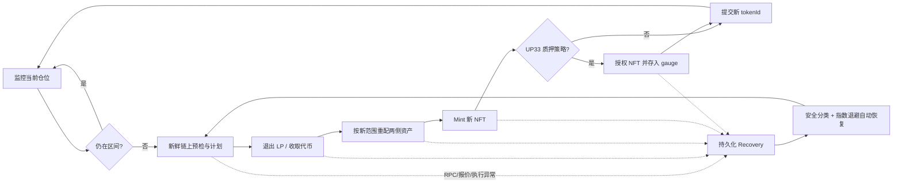
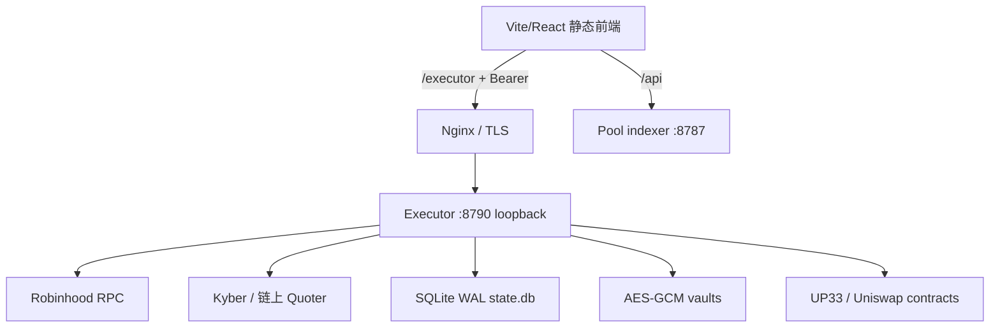

# LP 自动策略系统交接文档

> 最后核对：2026-08-10（Asia/Shanghai）
> 生产入口：<https://lp.coinfetcher.xyz>
> 链：Robinhood Mainnet，chainId `4663`
> 钱包：`0x2bb53df69efa1b967660f2780ddcf6f76f90ae78`

本文是当前 LP 自动策略能力、代码结构、数据、部署和运维的权威交接入口。早期需求和实现过程分别保留在：

- [需求规划](./LP_STRATEGY_REQUIREMENTS.zh-CN.md)
- [实现规划](./LP_STRATEGY_IMPLEMENTATION_PLAN.zh-CN.md)
- [Executor 安全部署说明](../executor/README.zh-CN.md)
- [UP33 合约映射](./up33-contract-map.md)

历史文档描述的是阶段性设计；如果与本文或代码冲突，以当前代码和本文为准。

## 1. 交接结论

系统已经不是“模拟器 + 人工预检”原型，而是一套正在生产环境持续运行的自动化执行器：

1. 用户在网页输入一次管理员 Token，可建立多个具名签名账户，分别导入各自的策略热钱包私钥并创建策略。
2. 私钥只经同源 HTTPS 发送到 executor，使用独立 Master Key 加密后落盘。
3. 策略进入区间时持续监控；离开区间后自动退出、换币、按当前价重新开窄区间 LP。
4. UP33 质押仓位会自动解质押、领取 UP，固定先执行 UP→WETH；非 WETH 报价池再执行 WETH→quoteToken，之后复投并重新质押。
5. 每笔交易的 nonce、预计算 hash、目标地址、calldata hash 和回执先后写入 SQLite。
6. RPC、报价或进程故障进入自动恢复；除用户删除策略或全局紧急暂停外，策略应持续运行。
7. UI 展示当前策略资产、手续费、Gas、换仓成本、市场/LP 变化和按稳定币折算的累计盈亏。

### 最重要的运维约束

> **同一个钱包只能有一个 executor 进程负责签名。**

生产 executor 已接管当前钱包。本地 executor 应保持停止，否则两个进程可能竞争同一 nonce。开发者可以在本地运行静态前端和只读检查，但不得同时启动本地真实 executor。

### 绝不能提交或传播的内容

- 钱包明文私钥
- `/etc/lp-terminal-executor/master.key`
- `/etc/lp-terminal-executor/api.token`
- 带供应商密钥的 RPC URL
- `*.pem` SSH 私钥
- `state.db`、`state.db-wal`、`state.db-shm` 和 `vaults/` 的生产副本

本文只记录它们的存放位置，不记录任何内容。任何日志、工单或聊天都不得输出这些值。

## 2. 当前生产状态

截至本文核对时间：

- `https://lp.coinfetcher.xyz/executor/health` 返回 `ok: true`
- `vaultReady: true`、`signerReady: true`、`apiAuthReady: true`
- `rpcSource: file`
- executor 未全局暂停
- Recovery 列表为空
- 本地未发现 executor 进程

策略快照如下。`activeTokenId` 会随自动重开变化，后续必须从 API/数据库读取，不能写死：

| 策略 | 协议 | 区间 | 质押 | 手续费 | 低交易模式 | 核对时状态/Token ID |
|---|---|---:|---|---|---|---|
| `UNIV3 #638159 · ORIGINAL ±3%` | Uniswap V3 | ±3% | 否 | 复投 | 是 | monitoring / `647698` |
| `UP33 #36036 · ORIGINAL ±2%` | UP33 CL | ±2% | 是 | LP 费与 UP→WETH 复投 | 是 | monitoring / `38199` |
| `UP33 #38180 · ORIGINAL ±3%` | UP33 CL | ±3% | 是 | LP 费与 UP→WETH 复投 | 是 | monitoring / `38180` |

上表只是时间快照。交接时的实时事实请调用 `GET /v1/strategies` 和 `GET /v1/recovery`。

## 3. 产品能力

### 3.1 默认的一键 ORIGINAL 策略

普通用户主路径是：

1. 打开“策略”页并连接钱包。
2. 首次使用时输入管理员 Token；成功连接后浏览器保存它。
3. 如果 executor 尚无钱包，输入私钥导入热钱包。
4. 在可用 CL 仓位中选择仓位，选择对称区间，例如 ±2%、±3%、±5%。
5. 点击“启动并执行策略”。
6. 若仓位在区间内，立即进入 `monitoring`；若已在区间外，立即创建真实执行 job。

服务端会把快捷草稿规范化为：

- `preset/sourcePreset = original`
- 对称区间，保留用户选择的百分比
- executor 主循环每 4 秒处理 job/recovery；普通 spot 监控有 10 秒全局下限（实际约 10–12 秒）
- 普通轮询只读 `positions + slot0`，每 5 分钟及 tokenId/revision 变化时重验完整身份；任何签名前仍做完整链上预检
- 上下边界都为 `always + recenter`
- `fees.handling = reinvest`
- safeguards 默认关闭
- swap 最大滑点 100 bps
- plan 基础有效期 30 秒
- 真实 `executor_auto`
- 有限 Gas 上限和有限日成交上限由预检自动生成

日成交上限按每个策略独立计算：

```text
max(positionValue × max(20, ceil(100 / narrowBandPct)),
    projectedTurnover × 2,
    1 raw quote unit)
```

这样 ±2% 等窄区间拥有更多合理重开次数，同时不会因为其他策略成交而误触发钱包全局限额。

### 3.2 可选高级能力

底层 schema 和执行器仍支持最初需求中的高级选项，快捷入口没有删除这些能力：

- 范围：对称、不对称、固定 ticks
- 触发价格：spot、sampled TWAP
- 边界确认时间和重开冷却时间
- 上下边界独立策略
- 动作：`recenter`、`skew_recenter`、`hold_quote`、`pause`
- 条件：`always`、`fee_break_even`、`manual_confirm`
- 手续费：换成 quote、复投、原币持有
- 执行：仅通知、钱包确认、executor 全自动

自适应区间默认启用。仓位在目标存活时间（默认 120 分钟）前快速触边时，只有策略整体亏损且上一轮手续费未覆盖 Gas 与执行成本，下一仓位才按平方根寿命比例扩大，累计不超过 4 倍。扩大后的仓位存活满 360 分钟后，executor 检查最近 120 分钟的持久价格样本；仅当样本覆盖完整、全程未越出当前区间、峰谷波动不超过 250 bps、策略已回本且未领取手续费达到上一轮成本的 1.25 倍时，才以 `recoveryDecay`（默认 0.5）逐级收窄。每次收窄都会重建仓位并重新开始计时，避免宽窄状态抖动。
- 保护项：最低净 APR、每日最多重开、连续下破限制、风险币占比、价格冲击、滑点、计划时效
- 低交易模式开关

高级配置必须经过 [shared/strategy/schema.ts](../shared/strategy/schema.ts) 的运行时校验。生产 UI 当前以一键 ORIGINAL 为主，高级字段主要供后续 UI 和 API 开发使用。

### 3.3 账户、钱包与策略绑定

- 一个账户对应一个唯一钱包地址和一份独立加密 vault；可在网页中持续新增和重命名账户。
- 每条策略通过 `execution.walletId` 持久化绑定一个账户，且 signer 地址必须等于策略 owner/仓位所有者。
- 创建或启动策略时，网页按仓位 owner 地址自动选择匹配账户，不使用全局选择覆盖策略归属。
- 不同钱包的 job 可并行执行；同一钱包内所有签名操作仍由 wallet lock 串行，防止 nonce 竞争。
- 连接浏览器钱包用于发现该地址的仓位和发起浏览器签名；自动策略始终使用服务端该账户的加密私钥签名。
- API 只返回账户名称、地址和时间，不提供私钥或 vault 密文读取/导出接口。

### 3.4 支持的仓位

- Uniswap V3 未质押 NFT
- UP33 CL 未质押 NFT
- 已存入 UP33 gauge 的 CL NFT
- 必须是 chainId 4663 的官方 position manager/pool 组合
- executor signer、策略 owner 和仓位经济所有人必须一致

不支持：UP33 v2 LP 自动重开、Uniswap V3 第三方质押、跨链、多钱包共同管理同一策略。

### 3.5 自动重开执行链



非质押一轮包括：读取新鲜状态、退出/收取、必要换币、授权、mint、必要撤销授权、提交。质押策略在退出前增加解质押和奖励处理，在 mint 后增加重新质押。

### 3.6 UP33 质押与奖励

质押仓位离开范围时：

1. 验证 NFT 的 gauge custody 和原存款人。
2. 从 gauge 撤出旧 NFT；撤出会领取 UP。
3. 只按余额差额确认本轮实际收到的 UP。
4. 获取新鲜报价，将 UP 换成 WETH；如果策略 quoteToken 不是 WETH，再把本轮实际到账的 WETH 全额换成 quoteToken。每一段都独立检查实际支出、到账和最小输出。
5. `reinvest` 模式把最终 quoteToken 奖励纳入本轮或下一轮可部署资产。
6. 新 NFT mint 后授予 gauge NFT 权限并重新质押。
7. 再次验证 NFT owner 与 gauge 中的 tokenId。

Dashboard 的 `earned` 读取允许降级：若 gauge 暂时以 `NA` revert，LP 本体仍可估值，奖励估值显示暂不可用，不应让整个策略页失效。

### 3.6.1 提取已留存利润

策略页可将当前全部 `heldProfit` 结算为 USDG、WETH 或原生 ETH：

1. 只读取 allocation component 中的 `heldProfit`；`principal` 与 `heldFee` 不参与提取。
2. USDG/WETH 目标使用新鲜可执行报价、策略滑点上限、精确授权和回执余额差额；ETH 目标先统一为 WETH，再只解包属于本策略的精确数量。
3. 每个已确认兑换都会立即把策略归属从源币迁移到结算币；最终到账后再从 allocation 中释放，因此下一次预检不会出现账面资产仍被策略占用的问题。
4. 提取记录持久化目标币实际到账、USDG/WETH 核算价值、Gas 和交易哈希。界面同时显示当前留存、累计已提取、按到账币种累计和逐次历史。
5. 累计盈亏按 `当前策略资产 + 历史已提取价值 - 起点本金 - Gas` 继续计算；提取只是改变托管位置，不重置或吞掉历史利润。
6. 同一钱包的签名操作继续由 wallet lock 串行。若广播后进程中断，恢复器按交易哈希和 Transfer 日志补记已确认兑换；未确认的剩余部分继续作为留存利润，不会动用本金补足。

### 3.7 低交易模式

开启后：

- `decrease + collect` 尽量通过 position manager multicall 合并
- 空旧 NFT 保留，不额外 burn
- ERC-20 对已确认的 position manager / swap router 使用持久授权
- UP33 gauge 使用 ERC-721 operator approval
- 后续轮次复用授权

真实观测的典型重开交易数：

- Uniswap V3：约 3 笔
- UP33 质押：约 6 笔

交易数取决于是否需要换币、是否已有授权以及奖励是否为零。关闭低交易模式只影响未来执行，并不会自动撤销历史持久授权；如需撤销必须单独发送链上交易。

### 3.8 删除策略

删除是“停止自动化并归档本地记录”，不是链上平仓：

- 不销毁 NFT
- 不退出 LP
- 不自动解质押
- 不自动撤销持久授权
- 历史 job、cycle、ledger 和审计信息保留

如果存在已发送或不可安全判定的交易，删除会拒绝，并要求 executor 先完成安全恢复。

## 4. 安全与执行一致性

### 4.1 私钥保险库

默认生产方式是 UI 导入私钥后建立加密 vault：

- 密钥格式必须为 `0x` + 64 个十六进制字符
- KDF：scrypt，`N=131072, r=8, p=1`
- 加密：AES-256-GCM
- 每个 vault 使用独立 32-byte salt 和 12-byte nonce
- vault 文件原子写入、`0600`
- Master Key 与 vault 分开保存
- API、数据库和审计日志不记录私钥

也支持 `LP_EXECUTOR_PRIVATE_KEY_FILE + LP_EXECUTOR_PRIVATE_KEY_WALLET_ID` 的文件签名方式，但当前生产使用加密 vault，不建议无迁移理由切换。

### 4.2 API 边界

- executor 只能监听 `127.0.0.1` 或 `::1`
- 公网只能经同域 TLS 的 `/executor/` 反向代理访问
- `/auth/challenge` 与 `/auth/verify` 通过一次性钱包签名建立只读会话；其他非健康 API 必须携带 Bearer Token
- 浏览器 Origin 必须命中 `LP_EXECUTOR_ALLOWED_ORIGIN`
- nginx 不注入管理员 Token
- 请求体最大 16 KiB
- 私钥导入按来源 10 分钟最多 5 次
- 异常响应截断到 180 字符，且不会回显请求体

钱包只读登录的 challenge 绑定站点 Origin、钱包地址和 5 分钟有效期，验证后立即销毁，不能重放。成功后签发 8 小时的内存会话，令牌只保存在该标签页的 `sessionStorage`；Executor 重启会使现有只读会话失效。钱包会话只能读取自身地址对应的 wallet、strategy、performance、history、calendar 和 recovery，所有写接口及 RPC 指标仍要求管理员 Token。

管理员 Token 在成功连接后保存于当前站点浏览器的：

```text
localStorage key: lp-terminal:executor-admin-token:v1
```

刷新和重新打开网页会自动连接。无痕窗口、不同浏览器或清除站点数据后需要重新输入。这是使用便利性与 XSS 风险之间的明确取舍；前端新增第三方脚本时必须重新评估。

### 4.3 交易持久化与广播

[executor/signer.ts](../executor/signer.ts) 是唯一交易发送入口：

1. 核对 chainId、owner、nonce、Gas 和限额。
2. `estimateGas` 后增加 20% buffer。
3. 在首次广播前，将 nonce、目标、calldata hash 和本地推导的 tx hash 写入 SQLite。
4. 广播失败只在可证明为网络/RPC 短暂故障时重发完全相同的序列化交易。
5. 如果前一次响应丢失，使用本地 hash 查询链上，不改变 nonce/calldata。
6. 只有明确的 fee rejection 才允许同 nonce 提高 Gas 重新签名。
7. 等待默认 2 confirmations 后才进入下一资产步骤。

绝不能对“nonce 已被使用但无法识别交易”的情况盲发替代交易。

### 4.4 滑点与无保护 ORIGINAL

快捷 ORIGINAL 的 `safeguards.enabled=false` 是用户接受的高风险模式。为避免区块纳入前价格越界导致 LP decrease/mint 的 `Price slippage check`，LP decrease/mint 的 amount minima 可为 0，但 desired amount 仍限制最大支出。

这不代表 swap 无保护。每次 swap 仍需：

- 新鲜、身份一致的报价
- 固定 tokenIn/tokenOut/amountIn/sender/recipient/router
- 配置的 `maxSlippageBps`
- 交易后真实余额差额校验

开启 safeguards 后，LP 边界最小数量、价格冲击、风险敞口等保护重新生效。

## 5. 持续运行与恢复

### 5.1 状态

常用策略状态：

- `disabled`：未启用
- `monitoring`：正常监控
- `planned`：已生成 job，等待 runner
- `executing`：正在执行
- `recovery`：执行中断，等待安全恢复
- `recovery_quarantined`：单策略连续发生确定性恢复错误，已熔断隔离；其它策略继续运行
- `paused_guard`：保护条件暂停，但仍由监控器检查
- `awaiting_manual`：高级手工条件状态
- `dry_run_ready`：旧 dry-run 流程结果
- `archived`：已删除/归档，不再列出

正常产品路径不应要求用户点击“恢复”。[executor/supervisor.ts](../executor/supervisor.ts) 会自动扫描 Recovery job；退避从 5 秒开始，指数增长，最高 5 分钟。

恢复调度按签名钱包分组：不同钱包并行，同钱包只在存在 `sending/sent`
未决交易时临时串行。已经确认的故障任务不会阻止同钱包其它策略生成或执行
新 job。恢复次数、连续错误、下次重试和熔断时间持久化在 `jobs`；同一确定性
错误连续 3 次后只隔离该策略并进入 `recovery_quarantined`，进程重启不会清零。
RPC、报价和 pending 等瞬态错误继续指数退避，不触发确定性熔断。

每次签名前会把实际执行报价、`minOut` 和路由身份写入 `swap_plan`。恢复检查
会把链上已确认/回滚/明确未广播的交易事实回写本地 transaction 状态，不能用
旧规划报价否定一笔已经按新报价成功执行的交易。

管理员可在恢复卡片上立即重试或删除自动化。删除不会发送链上交易；只要所有
已提交交易已有明确结果，即使 swap/mint 后无法继续恢复，也允许归档为
`recovery_interrupted`，避免自动化记录永久不可删除。`pending/manual_review` 仍禁止
直接删除，因为此时链上结果尚不明确。

### 5.2 恢复分类

| 分类 | 含义 |
|---|---|
| `restart_safe` | 没有链上变更，可放弃旧计划并重新监控/计划 |
| `resume_collect` | 已退出流动性，继续收取 |
| `resume_from_wallet` | 资产已回钱包，继续换币/mint |
| `resume_staking_exit` | 已处理部分质押退出/奖励链，继续 |
| `resume_revoke` | 已 mint，完成授权收尾/撤销 |
| `commit_ready` | 链上动作已完成，只需提交数据库状态 |
| `wait_pending` | 交易仍 pending，等待，不重发 |
| `manual_review` | nonce/交易身份不明确，禁止盲目执行 |

启动时，进程会把被中断的 running job 隔离为 Recovery。`executorPaused=true` 会阻止监控、runner、supervisor 和每笔新签名。

### 5.3 自动重试范围

以下故障预期自动恢复：

- RPC timeout、连接中断、429/502/503/504
- 报价服务短暂不可用（包括 `E_KYBER_QUOTE`）
- 未发生链上变更前计划过期
- 明确 reverted 且没有任何确认的状态变更
- pending 交易在后续确认

`manual_review` 只应用于无法证明安全性的 nonce 歧义，不应为了“策略必须一直运行”而绕过。

## 6. 盈亏和资产核算

### 6.1 双口径公式

累计盈亏不是“累计手续费”。界面可在两种独立口径间一键切换：

```text
报价币盈亏 = 当前策略资产（quote）- 核算本金（quote）- 累计 Gas（quote）

稳定币盈亏 = 当前策略资产（USDG 当前价值）- 策略起点资产（USDG 起点价值）- 累计 Gas（USDG 当前价值）

累计盈亏
= 净手续费
 - Gas
 - 换仓执行成本
 + 市价与 LP 库存变化
```

稳定币口径不是把“报价币盈亏”按今天价格简单折算。策略启动时会同时固化 quote 数量和 6 位精度的 USDG 价值；当前资产再按当前 WETH/USDG 链上锚定价格计量。因此起点 0.05 WETH = 100 USDG、当前 0.04 WETH = 120 USDG 时，报价币口径为负，稳定币口径为 +20 USDG（再扣 Gas）。旧 WETH 策略若尚未固化 USDG 起点，会读取基准区块之前最后一笔官方 WETH/USDG 池 Swap，回填当时有效的 slot0 价格；不会用今天价格冒充历史价格。

其中当前策略资产包括：

- 当前 NFT 内的两种 principal
- 未领取 LP 手续费
- 归属于该策略的 wallet carry/allocation
- 可读取并可报价的未领取 UP 奖励

“累计手续费收益”包括 LP fee 和已兑换的质押奖励，扣除可识别的协议费；它不等于总盈亏。

换仓成本使用已持久化事实重算：以“退出前来源 LP 池的无费现货输出”和“本轮实际可执行报价输出”中较优者为基线，再与链上实际到账比较。这样既覆盖池手续费/规模冲击，也保留聚合路由优于来源池时仍真实发生的报价滑点；两种差额取同一较优基线，不重复相加。若实际到账优于两种基线，净换仓成本可以合法为 0。

### 6.2 本金基线

优先从最早自动化仓位的原始 mint 区块重建：

- mint 实际投入的 token0/token1
- mint 区块价格
- 原始开仓 Gas；WETH 报价策略按 wei 直接计入，其他报价策略按当前可执行的 WETH→quoteToken 报价折算

收益税同时覆盖两种可审计路径：非 USDG 收益兑换为 USDG 时记录 `fee_tax` swap；已收到的 USDG 直接留存时记录 `income_tax`。旧周期没有显式 `income_tax` 行时，从持久化的 `fee_tax.retainedUsdg` 作兼容回算。

如果历史 RPC/indexer 无法重建，则回退为“首次自动退出前一刻”的 principal 市值，并显示：

- `pnl_baseline_first_automated_exit`
- `pnl_baseline_mint_unavailable`

原始 mint 重建成功则显示 `pnl_baseline_original_mint`。转入钱包、旧版无快照或历史节点数据缺失时，盈亏是最佳可审计估计，不应隐藏 warning。

### 6.3 价格和不完整估值

- 策略内部以 quote token（当前主要为 WETH）核算
- UI 可显示原报价币盈亏，或按“起点 USDG 价值 vs 当前 USDG 价值”独立计算稳定币盈亏
- 这不是稳定币实际余额，而是实时折算值
- `earned` 或奖励报价失败时，奖励部分标记不可用，避免把未知值当成 0 计算盈亏
- `planned/executing/recovery` 时显示 `execution_in_progress`，执行中的中间余额不能被误认为最终净值

主要实现见 [executor/performance.ts](../executor/performance.ts)、[executor/cost-basis.ts](../executor/cost-basis.ts) 和 [executor/accounting.ts](../executor/accounting.ts)。

## 7. 架构和代码导航



| 路径 | 职责 |
|---|---|
| `src/components/tabs/StrategyTab.tsx` | 创建/启动/监控/删除策略，Token 记忆，性能展示 |
| `src/lib/executorClient.ts` | 浏览器 executor API 客户端 |
| `src/lib/strategyPlanner.ts` | 浏览器策略草稿和仓位映射 |
| `src/lib/strategyStore.ts` | 本地策略草稿持久化 |
| `shared/strategy/types.ts` | 策略、计划、账本和模拟器类型 |
| `shared/strategy/schema.ts` | 配置默认值和运行时校验 |
| `shared/strategy/planner.ts` | 确定性步骤计划 |
| `shared/strategy/simulator.ts` | APR/线性价格路径模拟 |
| `executor/api.ts` | 鉴权 HTTP API |
| `executor/config.ts` | 环境变量、配置文件和 secret 权限校验 |
| `executor/simple.ts` | 一键 ORIGINAL 的服务端默认值与启动 |
| `executor/monitor.ts` | 区间监控、确认、冷却和自动 job 创建 |
| `executor/preflight.ts` | owner/pool/Gas/路由/仓位/成交额预检 |
| `executor/runner.ts` | 正常执行主流程 |
| `executor/staking.ts` | gauge 撤出、UP→WETH→quoteToken、重新质押 |
| `executor/allowance.ts` | 精确授权和持久授权 |
| `executor/kyber.ts` | Kyber 报价/build 与本地 CL/Univ3 fallback |
| `executor/signer.ts` | 唯一签名、广播和回执跟踪入口 |
| `executor/recovery.ts` | 恢复事实检查和分类 |
| `executor/recovery-runner.ts` | 从各安全阶段继续执行、删除策略 |
| `executor/supervisor.ts` | 无人值守自动恢复 |
| `executor/retry-state.ts` | 5 秒至 5 分钟指数退避 |
| `executor/store.ts` | SQLite schema、事务、账本、状态提交 |
| `executor/performance.ts` | 当前净值和盈亏分解 |
| `executor/vault.ts` | 私钥导入、加密和解锁 |
| `deploy/lp-terminal-executor.service` | systemd executor 单元模板 |

## 8. 数据模型

生产数据库为 SQLite，WAL 模式，`synchronous=FULL`：

| 表 | 用途 |
|---|---|
| `wallets` | walletId、地址、vault 路径；无私钥 |
| `strategies` | 完整配置、walletId、当前状态 |
| `jobs` | 每次执行计划和 job 状态 |
| `job_steps` | 逻辑步骤状态和主交易事实 |
| `job_transactions` | 一个步骤内多笔交易的逐笔事实 |
| `allocations` | 归属某策略但暂存在钱包的 token 数量 |
| `allocation_components` | wallet carry 中 principal / held fee 分解 |
| `ledger_entries` | fee、gas、swap、mint、reward 等账本 |
| `cycles` | 一次旧 NFT → 新 NFT 的重开记录 |
| `daily_turnover_reservations` | 每策略 job 的日成交预留/结算 |
| `job_context` | 恢复所需的余额、报价、退出估值等事实 |
| `monitor_state` | 越界方向、开始时间、冷却、最后 tick/NFT |
| `price_samples` | sampled TWAP 样本 |
| `audit_events` | API/monitor/runner/supervisor 审计 |
| `executor_flags` | 全局暂停等开关 |

数据库和 vault 必须作为一个一致的签名状态迁移；只复制数据库或只复制 vault 都会造成不可恢复的不匹配。

## 9. HTTP API

公共：

| 方法 | 路径 | 说明 |
|---|---|---|
| GET | `/health` | 健康、RPC 来源、vault/signer/auth、暂停状态 |

其余均需 `Authorization: Bearer <admin-token>`：

| 方法 | 路径 | 说明 |
|---|---|---|
| POST | `/v1/pause-all` | `{ "paused": true/false }` |
| GET | `/v1/wallets` | 已导入钱包，不返回 vault 路径/私钥 |
| GET | `/v1/rpc-metrics` | 自进程启动后的 provider HTTP 请求数、JSON-RPC 方法数、每分钟均值和方法分布 |
| POST | `/v1/wallets/import` | 导入私钥并创建加密 vault |
| GET | `/v1/strategies` | 策略、状态、latest job |
| GET | `/v1/performance` | 所有策略的净值、PnL、费用和 warning |
| GET | `/v1/recovery` | 当前 open/recovery jobs、步骤、交易事实 |
| POST | `/v1/jobs/:id/recover` | 只检查恢复分类 |
| POST | `/v1/jobs/:id/resume` | 执行一次安全恢复；正常由 supervisor 调用 |
| POST | `/v1/strategies/:id/plan` | 生成新鲜计划/预检 |
| POST | `/v1/strategies/:id/execute` | 手工创建一次 job |
| POST | `/v1/strategies/:id/resume-monitoring` | 从 safety pause 恢复监控 |
| DELETE | `/v1/strategies/:id` | 停止并归档自动化，不进行链上平仓 |
| POST | `/v1/simple/strategies/:id/start` | 一键启动 ORIGINAL |
| PUT | `/v1/strategies/:id` | revision 乐观锁下更新完整配置 |

API 不提供任意 calldata 发送接口，也不提供私钥导出接口。

## 10. 生产部署

### 10.1 主机和目录

- 域名：`lp.coinfetcher.xyz`
- 当前主机：AWS Lightsail Tokyo，`52.197.16.0`
- SSH 用户：`admin`
- SSH key 目前位于工作区根目录 `LightsailDefaultKey-ap-northeast-1.pem`；它不属于仓库，绝不能提交

| 内容 | 生产路径 |
|---|---|
| 前端当前软链 | `/var/www/lp-terminal/current` |
| 前端 releases | `/var/www/lp-terminal/releases/` |
| indexer 当前软链 | `/opt/lp-terminal-indexer/app` |
| indexer releases | `/opt/lp-terminal-indexer/releases/` |
| executor 当前软链 | `/opt/lp-terminal-executor/app` |
| executor releases | `/opt/lp-terminal-executor/releases/` |
| executor DB | `/opt/lp-terminal-executor/data/state.db` |
| encrypted vaults | `/opt/lp-terminal-executor/data/vaults/` |
| Master Key | `/etc/lp-terminal-executor/master.key` |
| API Token | `/etc/lp-terminal-executor/api.token` |
| private RPC 配置 | `/etc/lp-terminal-executor/rpc.url` |
| executor service | `lp-terminal-executor.service` |
| indexer service | `lp-terminal-indexer.service` |
| nginx config | `/etc/nginx/conf.d/lp.coinfetcher.xyz.conf` |

服务监听：indexer `127.0.0.1:8787`，executor `127.0.0.1:8790`。executor systemd 为 `Restart=always`、`RestartSec=5`。

RPC 限频相关环境变量：

- `LP_EXECUTOR_MONITOR_MIN_SECONDS=10`：已有策略即使保存了 4 秒轮询，也至少每 10 秒读取一次边界；按 4 秒主循环对齐后实际约 10–12 秒。
- `LP_EXECUTOR_MONITOR_IDENTITY_TTL_SECONDS=300`：监控身份缓存 5 分钟；过期后重验 owner/custody、pool identity、fee/spacing 和 token metadata。
- 读请求启用 JSON-RPC batch；广播请求不批量且不做传输层自动重发。
- 策略页的状态、绩效、仓位/池目录分别按 8 秒、30 秒、120 秒刷新，标签页隐藏时停止定时请求。

RPC 读取复用（2026-08-11 上线）：

- 同一轮到期的多条策略先读取一个共同区块号，再把所有 `positions(tokenId)` 与 `slot0()` 合并为一次 Multicall3；策略仍独立判定和隔离错误，不会因一条策略读取失败而跳过其他策略。
- owner/custody、pool identity、fee/spacing、token metadata 等完整身份检查仍每 300 秒执行一次，并且在 token id、revision 或质押状态变化后立即失效；签名前的完整 preflight 没有复用监控缓存。
- `/v1/performance` 优先复用不超过两个监控周期的仓位快照。质押仓位只补读实时 `earned`；未质押仓位仍执行精确的 collect simulation，因此费用显示精度不变。
- 池子页保持 20 秒动态刷新：每轮仍更新 tick、价格、liquidity、stakedLiquidity、weight 和奖励流；池地址目录只在 factory count 改变时重取，CL 静态字段每 60 秒刷新。
- 仓位页保持 15 秒动态刷新：已知仓位用一次定向 multicall 更新 owner、liquidity、range、tick、pool liquidity 和 reward，未质押手续费仍每轮精确模拟；全量钱包/gauge/NFT 发现每 60 秒执行，已知 token 的 owner/custody 变化会在下一次 15 秒刷新立即触发重新发现。

上线验证基线：优化前、3 条策略运行时 executor 约为 `55.94 JSON-RPC methods/min`（其中 `eth_call + eth_blockNumber` 约 `54.68/min`）。新版本上线 17 分钟的累计值为 `38.06 methods/min`，其中监控相关 `eth_call + eth_blockNumber` 约 `34.29/min`；这个窗口还真实完成了两次换仓、共广播 9 笔交易，因此不是通过闲置策略得到的低值。普通稳态仍建议用 `/v1/rpc-metrics` 两次读数做差计算，避免启动预热或换仓流量干扰。前端同机同页对比中，旧池子页约 `15–17 /rpc HTTP requests/min`，新池子页完整分钟约 `12 /rpc HTTP requests/min`，刷新周期仍为 20 秒。

### 10.2 日常只读检查

```bash
# 公网健康检查，不需要管理员 Token
curl -fsS https://lp.coinfetcher.xyz/executor/health

# 登录服务器
ssh -i ../LightsailDefaultKey-ap-northeast-1.pem admin@52.197.16.0

# 服务、日志和软链
sudo systemctl status lp-terminal-executor lp-terminal-indexer nginx --no-pager
sudo journalctl -u lp-terminal-executor -n 200 --no-pager
readlink -f /opt/lp-terminal-executor/app
readlink -f /var/www/lp-terminal/current
```

不要将带管理员 Token 的 curl 命令放进 shell history、截图或工单。优先在网页查看；确需命令行时，从权限为 `0600` 的 token 文件临时读取，并在用后 `unset` 变量。

### 10.3 更新前端

生产 build 不得把私有 RPC 烘焙进静态 JS。推荐本地构建，再上传新的不可变 release，最后原子切换 `current` 软链：

```bash
cd /Users/alex/Work/LP/lp-terminal
RPC='' npm run build
```

上传前检查 `dist/` 中不存在供应商 API key 或私有 RPC URL。切换后验证首页、`/api/health` 和 `/executor/health`。

### 10.4 更新 executor

执行器更新必须保留生产 `data/` 和 `/etc/lp-terminal-executor/`，不能用空目录覆盖。推荐顺序：

1. 确认没有正在执行的 job；必要时全局暂停并等待现有链上步骤安全收敛。
2. 在本地运行 typecheck、tests 和 executor smoke。
3. 上传代码到新的 `/opt/lp-terminal-executor/releases/<timestamp>`。
4. 在新 release 安装锁定依赖，不在服务器做前端生产 build。
5. 原子切换 `/opt/lp-terminal-executor/app` 软链。
6. `sudo systemctl restart lp-terminal-executor`。
7. 检查 health、日志、策略状态和 Recovery。
8. 若之前暂停，确认无异常后再恢复。

不要在升级时启动本地 executor。不要修改旧 release；软链保留回滚能力。

### 10.5 Release 保留策略

每次生产部署完成、软链切换成功且 health/smoke 检查通过后，前端、indexer、executor 的 release 目录都必须只保留按 release 名称内 UTC 时间戳排序的最近 3 个（新上线版本计入 3 个）。这是固定的生产空间策略，不允许无限累积历史 release。

先在服务器上预览，再明确执行：

```bash
# 从仓库根目录把脚本传给生产机；第一次不传 --apply，只输出保留/删除清单
ssh -i ../LightsailDefaultKey-ap-northeast-1.pem admin@52.197.16.0 \
  'sudo bash -s' < deploy/prune-releases.sh

# 核对清单无误后执行
ssh -i ../LightsailDefaultKey-ap-northeast-1.pem admin@52.197.16.0 \
  'sudo bash -s -- --apply' < deploy/prune-releases.sh
```

脚本会保护当前 `current`/`app` 软链目标，并在被保留 release 仍通过顶层软链依赖旧 release（例如复用旧 `node_modules`）时拒绝删除。遇到这种情况必须先在被保留 release 内重新安装或实体化依赖，不能绕过检查。清理不得触及 `data/`、`backups/`、`vaults/` 或 `/etc/lp-terminal-executor/`。完成后检查三个软链、服务 health、`df -h /` 和 `df -i /`。

### 10.6 再次迁移服务器

要让当前钱包和策略无缝继续，必须迁移以下一致集合：

1. 停止旧 executor，确保它不再签名。
2. 备份并复制 `state.db` 及同目录 WAL/SHM（停进程后复制最安全）。
3. 复制完整 `vaults/`。
4. 通过安全通道复制原 Master Key；不能生成新 key 替代，否则旧 vault 无法解密。
5. 复制 API Token（保留现有浏览器记忆）和 private RPC 配置。
6. 校验所有 secret 和 vault 权限为 `0600`，目录 `0700`，属主为 `lpexecutor`。
7. 新机先 loopback 启动，核对 wallet/strategies/recovery。
8. 切换 DNS/反代后再开放新 executor。
9. 确认新机正常后，旧机仍保持永久停止。

迁移时如果存在 `pending` 或 `manual_review` job，先等待交易明确或完成事实核对，不要在新机直接重置 nonce/状态。

### 10.7 备份和回滚

最安全的一致备份流程会短暂停止 executor：

1. 确认没有 job 正在签名。
2. 停止 service。
3. 复制 `data/`、`vaults/` 和 `/etc/lp-terminal-executor/` 到加密备份介质。
4. 记录当前 app release 软链。
5. 立即重启 service 并验证 health。

代码回滚只切换 app release；数据 schema/账本若已被新版本写入，不可假定旧代码兼容。涉及 schema 的发布必须附带前向/后向迁移和专门回滚说明。

## 11. 本地开发与验证

所有 npm 命令必须在包含 `package.json` 的目录运行：

```bash
cd /Users/alex/Work/LP/lp-terminal
npm install
npm run typecheck
npm test
npm run smoke:strategy
npm run smoke:executor
npm run smoke:executor-api
npm run smoke:executor-integration
npm run build
```

`npm run preflight:real` 是只读链上夹具检查，不导入私钥、不广播交易。真正会签名的 executor 测试必须使用专用小额 canary 钱包和独立数据库，不能指向生产钱包。

本地 UI：

```bash
npm run dev
# 默认 http://127.0.0.1:5173
```

本地 executor 如确需测试，应使用独立临时目录、独立测试钱包、独立 Token/Master Key，且首先确认生产 executor 不管理这个测试钱包。

### 发布验收清单

- [ ] `npm run typecheck` 通过
- [ ] `npm test` 通过
- [ ] strategy/executor/API/integration smoke 通过
- [ ] build 产物不包含私钥、管理员 Token或私有 RPC key
- [ ] `/executor/health` 200，protected API 无 Token 为 401
- [ ] `rpcSource=file`、signer/vault/auth ready
- [ ] executor 只监听 loopback
- [ ] 只有一个进程管理生产钱包
- [ ] 现有 strategy IDs、walletId、activeTokenIds 可读
- [ ] Recovery 无未知 `manual_review`
- [ ] monitoring 策略轮询正常
- [ ] 测试一次可控 canary 重开后，新 tokenId、ledger、PnL、质押 custody 都正确
- [ ] 刷新网页后管理员 Token 能自动恢复连接

## 12. 常见故障定位

| 错误/现象 | 含义 | 处理原则 |
|---|---|---|
| `authentication required` | 管理 Token 未发送/不一致，或钱包只读会话已过期/因 Executor 重启失效 | 普通查看重新发起钱包签名；管理操作核对正确 token 文件且不要打印值 |
| `E_KYBER_QUOTE` | Kyber 与本地 Quoter 暂无可用报价 | 自动退避重试；核对 token/pool/RPC，不要手工伪造 route |
| `E_DAILY_LIMIT` | 策略当天成交预留超限 | 检查是否旧配置、错误归属或真实高频震荡；不要简单改成无限 |
| `E_PLAN_STALE` | 计划过期 | 无链上变更时自动回监控并生成新计划 |
| `E_POSITION_CHANGED` | NFT、liquidity、owner 与计划不一致 | 查是否用户手工操作或另一 executor；重新读链上事实 |
| `E_TX_REVERTED` | 明确链上 revert | 无已确认变更可重新计划；否则按 Recovery 阶段继续 |
| `E_RECOVERY_PENDING` | 已广播交易尚未明确 | 等待；禁止换 nonce 盲发 |
| `E_NONCE` / `manual_review` | nonce 被未知交易占用或身份歧义 | 查本地 tx hash、链上 nonce 和外部钱包操作，人工判定 |
| `E_GAS_PRICE_LIMIT` | 当前 Gas 超过策略 cap | 自动等待回落，或经明确评估后提高有限 cap |
| `earned ... NA` | gauge 奖励视图暂不可读 | 估值降级；LP 本体仍显示，稍后重试 |
| LP 仓位持续变小 | fee/reward 没有复投或 allocation 归类错误 | 核对 `fees=reinvest`、allocation components、mint desired amounts 和 swap 实际到账 |
| PnL 与记忆中的投入不符 | 基线回退、奖励估值失败、把手续费误当 PnL | 查 performance warnings、original mint basis、当前价值与 Gas 分解 |
| 换电脑后看不到策略且钱包未弹签名 | 旧前端缓存，或签名请求被拒绝/会话过期 | 强制刷新到最新资源，点击“重新请求签名”，确认钱包地址与策略 owner 一致 |
| 刷新后要重输管理 Token | localStorage 不可用/被清理/换浏览器 | 普通查看改用钱包签名；管理操作检查对应 origin 的 storage key |

排错顺序应是：API 状态 → executor 日志 → DB job/tx 事实 → 链上 hash/nonce/owner → 代码。不要先改数据库“让状态看起来正常”。

## 13. 已知限制和风险

- 本策略不做对冲，无法消除风险币单边暴跌、IL 或退出时全部变成风险资产的风险。
- 展示 APR 不保证持续；高 APR 可能在 TVL、交易量、排放或价格变化后迅速下降。
- 窄区间会放大手续费密度，也会增加重开频率、Gas、swap impact 和 MEV 风险。
- 无保护 ORIGINAL 的 LP amount minima 取舍是明确高风险决定，应保留 UI 风险提示。
- 生产是热钱包自动签名，应只放策略所需资金，不使用主资产钱包。
- 现有生产策略主要 quote 是 WETH；新策略也支持非 WETH quote，奖励固定经 WETH 中转后结算为策略 quoteToken。
- UP 奖励 view/报价可以暂时不可用，完整 PnL 会因此暂停计算。
- 原始 mint 历史数据不完整时只能以首次自动退出为基线。
- 持久授权降低交易数但扩大合约/路由器风险面。
- 删除策略不会撤销链上授权或解质押。
- 当前单机 SQLite 适合单签名 executor；做多副本高可用前必须设计 leader election/钱包级分布式锁，不能直接横向扩容。
- 生产主机资源有限，indexer 较重；优先本地 build、生产只运行静态文件和服务。

## 14. 后续开发优先级

### P0：不破坏当前资金安全

1. 为 executor 单元/集成测试补齐真实错误恢复矩阵，尤其 pending、nonce replacement、质押各阶段。
2. 建立加密、可恢复的一致备份和定期恢复演练。
3. 增加服务器告警：service down、Recovery 超时、manual review、RPC 长期失败、Gas 余额不足。
4. 为 DB schema 增加显式版本和 migration runner。
5. 建立最小资金 canary 策略作为每次 executor 发布门禁。

### P1：产品可用性

1. UI 将“自动重试中/等待 pending/需人工审查”区分显示，并展示下一次重试时间。
2. 增加只读运维页：服务 uptime、RPC 延迟、最后监控、最后成功 cycle、Recovery 原因。
3. 增加策略暂停/恢复按钮，和“仅删除自动化”更明确的二次确认。
4. 增加授权查看与一键撤销工具。
5. 盈亏页增加本金基线详情和每轮资产守恒对账。

### P2：策略研究

1. 将模拟器扩展为历史 tick/成交量回测，纳入 Gas、实际池费、价格冲击和离散触发。
2. 根据波动率/成交量动态选择区间，而不只用固定百分比。
3. 比较立即重开、确认后重开、单边持有和 skew recenter 的真实结果。
4. 为异常流动性下降、税费 token、报价偏离加入黑名单和更强资产兼容检查。

## 15. 接手后的第一小时

1. 阅读本文、`executor/simple.ts`、`executor/runner.ts`、`executor/recovery.ts` 和 `executor/store.ts`。
2. 运行本地 typecheck/tests/smoke，但不要启动生产钱包的本地 executor。
3. 检查公网 health、生产 service 和最近 200 行日志。
4. 通过受保护 API 读取 wallets、strategies、performance、recovery。
5. 对照当前链上 tokenId 的 owner/gauge custody。
6. 确认三个生产策略仍持续监控/执行，且没有未知 Recovery。
7. 在任何写入修改前完成 DB + vault + Master Key 的一致备份。

做到这一步后，接手者才应开始修改真实执行链。
